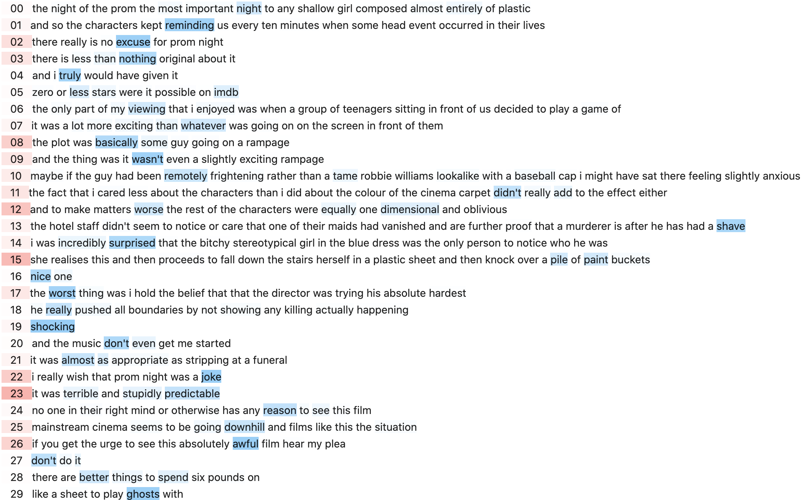

# Hierarchical Attention Networks for Document Classification
This repository contains a modern implementation of a 2016 [NAACL](https://en.wikipedia.org/wiki/North_American_Chapter_of_the_Association_for_Computational_Linguistics) paper [Hierarchical Attention Networks for Document Classification](https://www.aclweb.org/anthology/N16-1174.pdf) using [a labeled data set that consists of 50,000 IMDb movie reviews, specially selected for sentiment analysis](https://www.kaggle.com/c/word2vec-nlp-tutorial/data). This framework can be adapted to other text data sets for multi-label classification easily.

### Getting Started
To install all libraries/dependencies used in this project, run
```bash
brew install graphviz
pip3 install -r requirement.txt
```

For Windows or Linux users, it is recommended to use [Conda](https://docs.conda.io/en/latest/) to install [graphviz](https://graphviz.org/) in order to save model structures to `.png` files.

`preprocess.ipynb` generates training, validation, test data, tokenizer, and word embedding weights. `model.ipynb`, with slight configuration differences made (e.g. loss, optimizer, etc.) in comparison to those mentioned in paper, trains, saves, and evaluates models with words' and sentences' weights visualizations.

